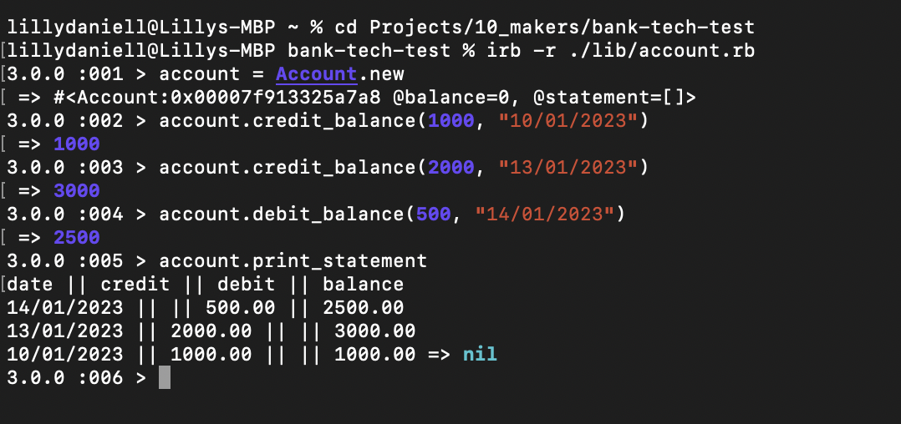

# Bank tech test

### Set up

* Fork and clone this repo
* Run `bundle install`
* To test run `rspec`
* Run `irb -r ./lib/account.rb`
* Interact with the instance of Account via the following methods:
  * `account.credit_blance(amount, date)`
  * `account.debit_blance(amount, date)`
  * `account.print_statement`
  * NOTE: the current date will be added to credit or debit actions unless otherwise specified.

### Test planning table

INPUT                 | OUTPUT
----------------------|--------
account.credit(1000)  | 1000
account.credit(2000)  | 3000
account.debit(500)    | 500

### Approach

* Each instance of the account starts with a balance of zero. 
* When the user deposits money, this changes the balance, and pushes the date, the credit value and the current balance (as a formatted string) to the statement array. 
* The same happens for a withdrawal, only the string that is pushed to the statement array has the debit value and updated balance, as well as the date of the withdrawal. 
* To get a statement, the user must call the method print_statement() for an overview of their account activity. 

### Screenshot of running app




## Specification

### Requirements

* You should be able to interact with your code via a REPL like IRB or the JavaScript console.  (You don't need to implement a command line interface that takes input from STDIN.)
* Deposits, withdrawal.
* Account statement (date, amount, balance) printing.
* Data can be kept in memory (it doesn't need to be stored to a database or anything).

### Acceptance criteria

**Given** a client makes a deposit of 1000 on 10-01-2023  
**And** a deposit of 2000 on 13-01-2023  
**And** a withdrawal of 500 on 14-01-2023  
**When** she prints her bank statement  
**Then** she would see

```
date || credit || debit || balance
14/01/2023 || || 500.00 || 2500.00
13/01/2023 || 2000.00 || || 3000.00
10/01/2023 || 1000.00 || || 1000.00
```
